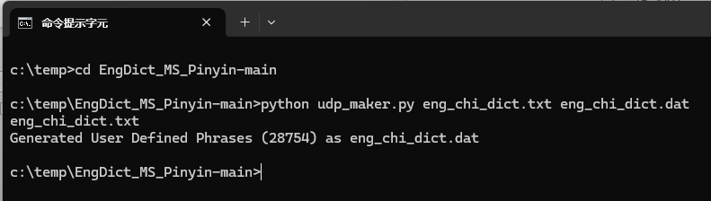

# 為微軟拼音輸入法加入漢英字典的功能(使用者造詞)
 [English version](README.md)

## 參考
- [UserDefinedPhraser](https://github.com/kyan001/UserDefinedPhraser): 使用來自 [UserDefinedPhraser](https://github.com/kyan001/UserDefinedPhraser/blob/master/phrasers/msphraser.py) 的代碼片段：此項目中使用了 `msphraser` 文件的一部分。

## 簡介
這個 Python 代碼，可以讓您將大量「使用者造詞」添加到微軟拼音輸入法中。

## 文件格式 
文件格式為：
```txt
(code)(space)(phrase)
```
一個簡單的文件例子:
```txt
apple 蘋果
banana 香蕉
```
作為一個範例， 一個漢英字典 [eng_chi_dict.txt](eng_chi_dict.txt) 已被加入了這個 repo.  
這個字典是繁體中文的。

## 從文本文件生成 *.dat 文件
要從文本文件生成 .dat 文件（以 eng_chi_dict.txt 為例，其他用戶定義文件也可以使用，只要文本文件是 UTF-8 並且沒有 BOM）

1) 安裝 Python
2) 打開 cmd 窗口並運行以下命令：
   ```sh
   python udp_make.py eng_chi_dict.txt eng_chi_dict.dat
   ```
3) eng_chi_dict.dat 文件已生成。
   
   cmd 窗口的示例屏幕截圖：
   

   
## 如何導入至微軟拼音輸入法

1) 在 Windows 中，請前往 系統設置 → 時間和語言 → 地區和語言 → 中文 → 首選項 → 微軟拼音 → 首選項 → 詞庫和自學 → 添加或編輯用戶定義短語： 
   選擇添加上面生成的 eng_chi_dict.dat。 
2) **注意:** 如果在運行 (1) 時 UI 發生卡住，這是因為之前添加的短語過多。您需要前往
   ``` txt
    C:\Users\<YOUR_NAME>\AppData\Roaming\Microsoft\InputMethod\Chs\
    ```
    文件夾（您可能需要在類似位置進行搜索），並刪除以下文件：
    ``` txt
    ChsPinyinEUDPv1.lex
    ```
